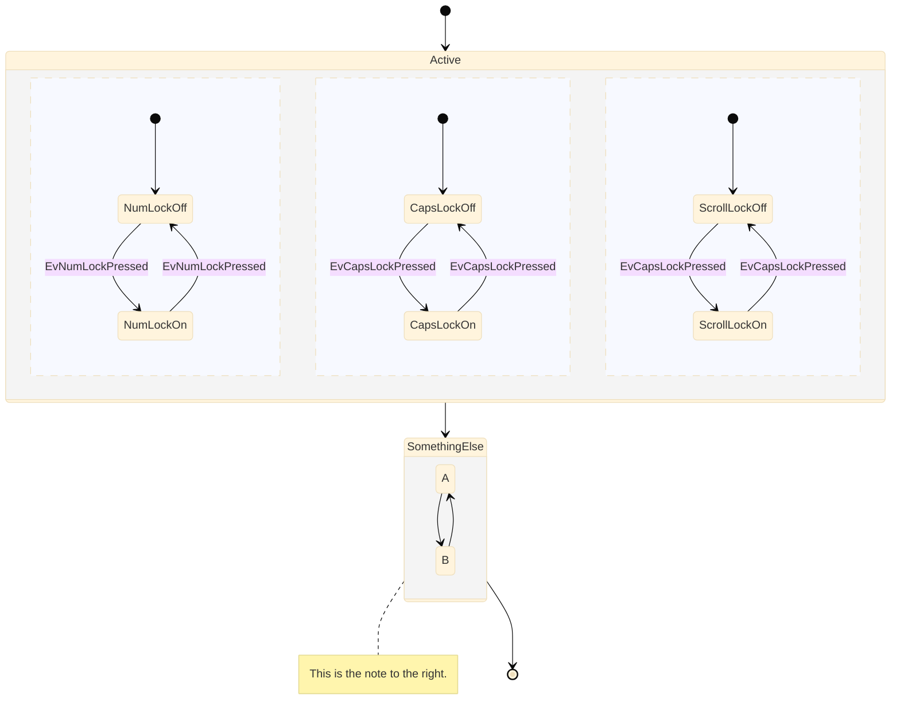

# Mermaid Demo

```mermaid
%%{init: {'securityLevel': 'loose', 'theme':'base'}}%%
%%{init: {'securityLevel': 'loose', 'theme':'base'}}%%
      stateDiagram
        [*] --> Active

        state Active {
            [*] --> NumLockOff
            NumLockOff --> NumLockOn : EvNumLockPressed
            NumLockOn --> NumLockOff : EvNumLockPressed
            --
            [*] --> CapsLockOff
            CapsLockOff --> CapsLockOn : EvCapsLockPressed
            CapsLockOn --> CapsLockOff : EvCapsLockPressed
            --
            [*] --> ScrollLockOff
            ScrollLockOff --> ScrollLockOn : EvCapsLockPressed
            ScrollLockOn --> ScrollLockOff : EvCapsLockPressed
        }
        state SomethingElse {
          A --> B
          B --> A
        }

        Active --> SomethingElse
        note right of SomethingElse : This is the note to the right.

        SomethingElse --> [*]

```